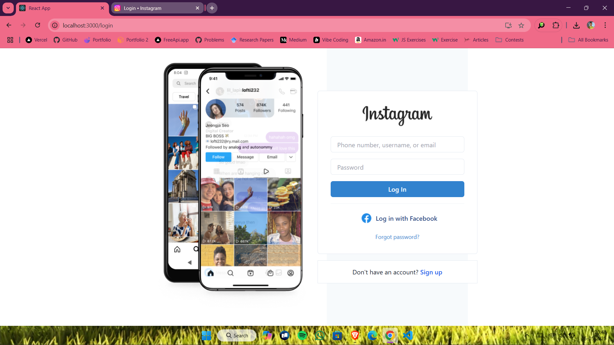
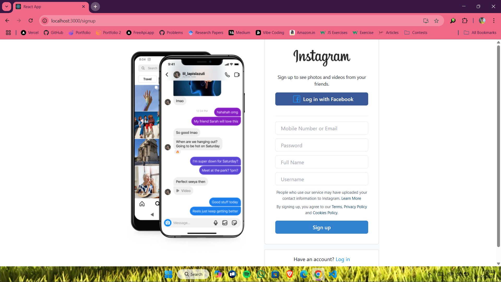
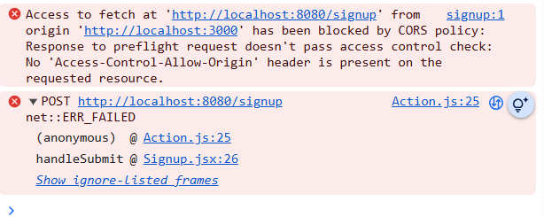

# Instagram Clone
I have made my first full stack project to practice my Java Springboot and React. And i have tracked my all day journey that how i have to do and implement the things. In this project i have tried to clone the Instagram features but some features are not there becoz i have to learn and implement it later. So feel free to learn and give the feedbacks that i can do it better.

## Tech Stack Used
- Frontend
    - React JS
    - React Redux
    - Redux Thunk
    - React Formik (for handling form)
    - React Yup
    - Tailwind CSS
    - Chakra UI
    - React Icon
    - React Router Dom
- Backend
    - Java SpringBoot
- DataBase
    - MySQL

## Procedure
### **Day-1 (Morning)**
- Firstly, i am going to design the Sidebar i.e. `Sidebar.jsx`.
- We're using React-icons inside the Sidebar so we will make a file named `config.js` to import all react-icons we are going to use inside Sidebar.
- Now we're moving towards the Profile section of a user.
- So making a folder named `Profile` in components and Pages.
- `src/Pages/Profile/Profile.jsx`
- `src/Components/Profile/UserDetails.jsx`
- `src/Components/Profile/PostsPart.jsx`
- `src/Components/Profile/PostCard.jsx`
---
### **Day-1 (Evening)**
- Now moving to the HomePage Section.
- Starting from Stories.
- `src/components/Story/Stories.jsx`.
- Now let's design the Posts of the HomePage.
- `src/components/Post/Post.jsx`.
- In post, we have profile pic, username, location(*it depends on user*), image or video or reel, like icon, comment icon, share icon, saved icon, total likes count, total comments count and comments showcase and at last textbox comment(*we can comment*).
---
### **Day-2 (Morning)**
- Now we will see that if we click on comment button then the post and all the comments come in a UI.
- We're gonna make this using Chakra UI.
- I have tried very much to solve the error of Chakra UI but let's see.
- I am facing too much problem in Chakra UI so i have decided to leave this part and move forward, i will do it later.
---
### **Day-3 (Morning)**
- I am making the comment part that when we click on comment the popup appears on which there is post(*left side*), username(*right-top*), comments(*after username*), like, comment, share, saved, total likes, date of post and comment textbox all this at *right-down side*.
- `src/components/Comment/Comment.jsx`
- `src/components/Comment/CommentCard.jsx`
---
### **Day-4 (Morning)**
- Now also i am working on the comment part that i was doing on Day 3.
- `src/components/Comment/Comment.css`
- I am leaving the comment popup thing, Let's do it some another day.
---
### **Day-5 (Afternoon)**
- Making the right part of home which the suggestions part in which peoples suggestions will come for user.
- `src/components/Home Right/HomeRight.jsx`
- `src/components/Home Right/Suggestions.jsx`
---
### **Day-5 (Night)**
- So basically, today i fixed package.json becoz the version of the packages are not compatible with eachother so i have to fix this all and it takes time. 
- I am sharing my package.json that helps you.
- And finally i have made comment popup thing and it is working.
```json
{
  "name": "instagram_clone",
  "version": "0.1.0",
  "private": true,
  "dependencies": {
    "@chakra-ui/icons": "^2.0.17",
    "@chakra-ui/react": "^1.6.7",
    "@emotion/react": "^11.4.0",
    "@emotion/styled": "^11.3.0",
    "@reduxjs/toolkit": "^1.6.2",
    "ajv": "^6.12.6",
    "ajv-keywords": "^3.5.2",
    "axios": "^0.24.0",
    "formik": "^2.4.6",
    "framer-motion": "^4.1.17",
    "react": "^18.2.0",
    "react-dom": "^18.2.0",
    "react-icons": "^5.5.0",
    "react-redux": "^8.0.5",
    "react-router-dom": "^6.3.0",
    "react-scripts": "^5.0.1",
    "redux": "^4.2.1",
    "redux-thunk": "^2.4.1",
    "web-vitals": "^2.1.4",
    "yup": "^1.6.1"
  },
  "devDependencies": {
    "autoprefixer": "^10.4.0",
    "postcss": "^8.4.5",
    "tailwindcss": "^3.0.5"
  },
  "scripts": {
    "start": "react-scripts start",
    "build": "react-scripts build",
    "test": "react-scripts test",
    "eject": "react-scripts eject"
  },
  "eslintConfig": {
    "extends": [
      "react-app",
      "react-app/jest"
    ]
  },
  "browserslist": {
    "production": [
      ">0.2%",
      "not dead",
      "not op_mini all"
    ],
    "development": [
      "last 1 chrome version",
      "last 1 firefox version",
      "last 1 safari version"
    ]
  }
}
```
---
### **Day-6 (Morning)**
- Going to make Create component in which we can upload images and videos.
- So starting with chakra ui. And react icons will also be used.
- In a create post, there is a image or video that we upload then there is caption to write and also location.
- `src/components/Post/CreatePost.jsx`
- `src/components/Post/CreatePost.css`

### **Day-6 (Afternoon)**
- Let's make the story part of the instagram means when we click on the Story circle then how much story you have put the progress bar appears.
- Basically, ProgressBar will show the story progress of a specific user.
- `src/components/Stories/ProgressBar.jsx`
- `src/components/Stories/ProgressBar.css`

### **Day-7 (Morning)**
- Thinking and doing the logic part of the progress bar.
- Using the hooks like useEffect for the duration and completion of the progress bar.
- Now let's make the Story viewer part that how it is going to be viewed on clicking.
- By making StoryViewer i learned about `styled-components`.
- I learned that to style any component we can do:
```js
// it is necessary to first alphabet be in Uppercase
const StoryViewerContainer = style.div`
    display: flex;
    justify-content: center;
    align-items: center;
    height: 100vh;
    background-color: black;
`
```
- `src/components/Stories/ProgressBar.jsx`
- `src/components/Stories/StoryViewer.jsx`
- And then connected this progress bar to the story viewer that by clicking the story gets visible.

### **Day-7 (Night)**
- So basically, now its time for the Search siderbar.
- We are going to design the Search Component.
- `src/components/Search/Search.jsx`
- `src/components/Search/Search.css`
- So Search design is completed and now let's design the part where the search results will be shown.
- `src/components/Search/SearchCard.jsx`
- Till now we're making the static website means the frontend part and now onwards going to make the website dynamic.

### **Day-8 (Morning)**
- Let's do Backend Part.
- So for backend we are using spring boot that is done in java.
- Firstly, download spring boot tools for eclipse.
- Now let's make api's.
- `application.properties`
```java
spring.application.name=instagram_api
server.port=5454
//db specific properities
spring.datasource.url=jdbc:mysql:/127.0.0.1:3306/instagram
spring.datasource.driver-class-name=com.mysql.cj.jdbc.Driver
spring.datasource.username=instagram
spring.datasource.password=MissAyese

//ORM s/w specific properities
spring.jpa.hibernate.ddl-auto=update
spring.jpa.show-sql=true
```
- Also go in SQL workbench and `CREATE DATABASE instagram;` 
- So let's make packages and classes for the backend. 
- In `src/main/java` folder, we will make different packages regarding our use cases
- `com.insta.instagram` => `InstagramApiApplication.java`
- `com.insta.instagram.dto` => `UserDto.java`
- I was getting an error of the database i.e., 
  - `Database JDBC URL [Connecting through datasource 'HikariDataSource (HikariPool-1)'] 
  Database driver: undefined/unknown 
  Database version: 8.0.40 
  Autocommit mode: undefined/unknown 
  Isolation level: undefined/unknown 
  Minimum pool size: undefined/unknown 
  Maximum pool size: undefined/unknown`
- To solve it, simply downgrade the spring-boot version from `3.4.5` to '3.3.5' in `pom.xml`.

### **Day-8 (Night)**
- Basically i am making api's for my instagram clone.
- Another packages and files are: 
- `com.insta.instagram.modal` => `Comment.java`, `Post.java`, `Story.java`, `User.java`
- `com.insta.instagram.service` => `UserService.java`
- Now going to handle the exceptions that can occur.
- `com.insta.instagram.exceptions` - `ErrorDetails.java`, `GlobalExceptions.java`, `UserException.java`

### **Day-9 (Morning)**
- Now moving towards making the repository.
- `com.insta.instagram.repository` => `UserRepository.java`
- Now we will work on user service that for implementation of services what user should be provided and what should be complete and what should be leaved as it is.
- `com.insta.instagram.service` => `UserServiceImplementation.java`

### **Day-10 (Morning)**
- In `com.insta.instagram.service` => `UserServiceImplementation.java`
- We are going to write logic for follow any user and to unfollow any User.
- We're gonna implement different methods for the users that are: `followUser`, `unFollowUser`, `findUserById`, `searchUser`, `updateUserDetails`, `findUserByUsername`
- Now going to make Api's for the above services or we can say that handlers to handle the user services.
- `com.insta.instagram.controller` => `UserController.java`

### **Day-11 (Morning)**
- Let's work on Spring Security.
- Firstly added some dependencies in `pom.xml` i.e.,
```xml
<dependency>
	<groupId>io.jsonwebtoken</groupId>
	<artifactId>jjwt-api</artifactId>
	<version>0.11.1</version>
</dependency>
<dependency>
	<groupId>io.jsonwebtoken</groupId>
	<artifactId>jjwt-impl</artifactId>
	<version>0.11.1</version>
	<scope>runtime</scope>
</dependency>
<dependency>
	<groupId>io.jsonwebtoken</groupId>
	<artifactId>jjwt-jackson</artifactId>
	<version>0.11.1</version>
	<scope>runtime</scope>
</dependency>
```
- Now making the package as: `com.insta.instagram.config`
- Making some classes for the configration of the user that are: `AppConfig.java`, `SecurityContext`, `JwtTokenGeneratorFilter` and `JwtTokenValidationFilter`.
- So Spring Security is completely done.

### **Day-12 (Morning)**
- We're gonna make Post API and there services, implementations and controllers.
- In `com.insta.instagram.service`, we will make an interface named `PostService` that will have all the services of Post API.
- We will make a new exception in the exceptions package that is `PostException`.
- Now i have completed `PostException.java` and `PostService.java`, let's move to the `PostServiceImplementation.java` inside `service` package.
- Before going to `PostServiceImplementation`, we will create a class named `PostRepository.java`.

### **Day-12 (Night)**
- In `UserServiceImplementation.java`, we have left a method incomplete so we're gonna complete it first.
- Before completing it, we need to make a new package => `com.insta.instagram.security` => `JwtTokenClaims` and `JwtTokenProvider`.
- Now we implemented all things in `UserServiceImplementation.java`.
- Moving to `PostServiceImplementation.java` in which we will handle all the services regarding the posts that are like, unlike, saved, unsaved, deleting the post and many more.

### **Day-13 (Morning)**
- So two methods of `PostServiceImplementation.java` i haven't completed that were likePost and unLikePost, let's complete them first.
- Now we're gonna implement different controller or handler for Post APIs i.e., `com.insta.instagram.controller` => `PostController.java`.
- So finally, all the APIs of post has being completed.

### **Day-14 (Morning)**
- Now we are gonna make Comment Api, in which we will implement service, serviceImplementation, repository and controller.
- In `com.insta.instagram.service`, we will make CommentService interface.
- In `CommentService.java`, there will be four services i.e., createComment, findCommentById, likeComment and unlikeComment.
- And in `com.insta.instagram.exceptions`, we will create `CommentException.java` to handle the exceptions of Comment API.
- In `GlobalExceptions.java`, we will implement handler for `CommentException.java`.
- We will implement `CommentServiceImplementation.java` inside `com.insta.instagram.service` package.
- Now in `CommentServiceImplementation.java`, we will implement the unimplemented methods that were in `CommentService.java`. Basically gonna write business logic.
- Oops, i forget to implement `CommentRepository.java`.
- It's time for implementing controller: `com.insta.instagram.controller` => `CommentController.java`.
- Comment API completed.

### **Day-14 (Night)**
- It's 7:30, gonna make Story Api, in which we will implement same service, serviceImplementation, repository and controller.
- `com.insta.instagram.service` => `StoryService.java`.
- In the `StoryService.java`, there will be two services i.e., creating story and seeing the story of others.
- `com.insta.instagram.repository` => `StoryRepository.java`.
- `com.insta.instagram.exceptions` => `StoryException.java`.
- `com.insta.instagram.service` => `StoryServiceImplementation.java`.
- `com.insta.instagram.controller` => `StoryController.java`.
- In `UserController.java`, there is some methods that i haven't implemented so i am going write the code for them.

### **Day-15 (Morning)**
- Now the backend part is almost completed.
- Moving back to vs-code for Registration system.
- In `Registration` => `Components`, we will make two files i.e., `Signup.jsx` and `Signin.jsx`.
- Also `Auth` => `Pages`, we will make two files i.e., `Auth.jsx` and `Auth.css`.
- Designing the signin and signup page - `Auth.jsx` and `Auth.css`.

### **Day-15 (Night)**
- The designing is completed. 
- Now time to implement `Signin.jsx` and `Signup.jsx`.
- Installing two packages: `npm i formik` and `npm i yup`.
- `Signin.jsx` has been implemented and looking good.
- 
- - `Signup.jsx` has been implemented and looking good.
- 

### **Day-16 (Morning)**
- Now we're going to implement redux.
- So we need some packages that are: `npm i redux redux-thunk react-redux`.
- `src/redux/Auth/Action.js`
- `src/redux/Auth/ActionType.js`
- `src/redux/Auth/Reducer.js`
- `src/redux/Store/Store.js`
- The above file have been completed, it was basically handling the signin and signup services.
- Now the user implementation, basically to handle the users signin and signup.
- `src/redux/User/Action.js`
- `src/redux/User/ActionType.js`
- `src/redux/User/Reducer.js`

### **Day-17 (Afternoon)**
- We have integrated signin and signup api.
- Now we will integrate all other APIs.
- Now we will integrate and implements for Post.
-  `src/redux/Post/Action.js`
-  `src/redux/Post/ActionType.js`
-  `src/redux/Post/Reducer.js`

### **Day-18 (Morning)**
- In `Action.js`, this file defines constants for your action types. Purpose of the file is to avoid hardcoding strings and prevent typos.
- In `ActionType.js`, this file contains the actual functions that dispatch actions — usually where the API calls happen. This is where the actual API call is made, and the result is passed to the reducer via actions.
- Now in `Reducer.js`, this file receives actions (including the data or error from the API call) and updates the state accordingly. The API is not called here — this file just responds to the dispatched actions and updates the state.
- Now for comments, we will do same things.
-  `src/redux/Comment/Action.js`
-  `src/redux/Comment/ActionType.js`
-  `src/redux/Comment/Reducer.js`
- Now for stories, we will do same things.
-  `src/redux/Story/Action.js`
-  `src/redux/Story/ActionType.js`
-  `src/redux/Story/Reducer.js`

### **Day-19 (Morning)**
- So now using Cloudinary, cloudinary is a free and we're going to use it for uploading the medias that we are doing in `CreatePost.jsx`.
- Going to do signup, again and again the same error is coming in the console.

- Today i am solving all the errors that exist till now and the parts which are not working.

### **Day-19 (Night)**
- Now we're going to remove the static pictures and the written things like 10M likes and comments.
- Implementing it dynamically now.

### **Day-20 (Morning)**
- Now we're setting up for like and unlike of post and comment & save and unsaved part dynamically. 
- So for this we have to write some logic, we will make a new file i.e., `src/components/Config/Logics.js`
- We have made 4 functions for the logics that are: 
  - `isPostLikedByUser`
  - `isCommentLikedByUser`
  - `isSavedPost`
  - `isFollowing`
  - `timeDifference`

### **Day-20 (Night)**
- Now doing the dynamic setup of the comment part in the components of comment.
- Basically setting all things from static to dynamic, for example showing username, comments, how much time ago comment have been posted.
- All comments are being created as dynamic.

### **Day-21 (Night)**
- It's time for making the Profile page dynamic.
- Basically from reqUser we have to get username, profile img, posts, saved and many more.
- In profile, we have forget to make the Edit profile component so we're going to implement it.
  - `src/components/Edit Profile/EditProfile.jsx`
  - `src/components/Edit Profile/ChangeProfilePic.jsx`

### **Day-22 (Morning)**
- Let's finish the unfinished components and the unfinished business logics.
- There are some APIs to handle and making the static things to dynamic.

### **Day-23 (Morning)**
- Today is last Day of the project.
- Checking all the edge cases and use cases of the project.
- Also trying to solve, study and learn the ERRORS that are occuring.

---

**THANK YOU FOR STUDYING & LEARNING THIS MUCH FAR ❤️**